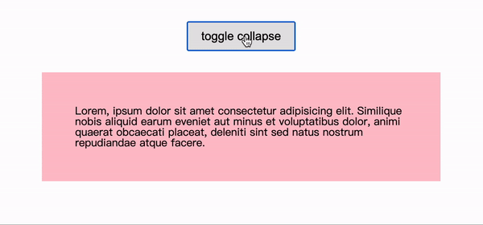

# サンプルコード - JavaScriptでドロップダウンアニメーションを作る

高さが可変する要素に対してドロップダウンアニメーションを付けたいとき、CSSだけで transition を使って height: 0; から height: 100%; にしても全然効かないので、今回は Bootstrap のソースコードを読んだ後に、Bootstrap のやり方をパクってシンプル化したコードを記載します。

<br>

  

<br>

[Codepen](https://codepen.io/deanocean/pen/LYyQVrN)

<br>

HTML:  
```html
<button data-trigger="collapse" data-target="#target">toggle collapse</button>

<div class="collapse" id="target">
  <p>Lorem, ipsum dolor sit amet consectetur adipisicing elit. Similique nobis aliquid earum eveniet aut minus et voluptatibus dolor, animi quaerat obcaecati placeat, deleniti sint sed natus nostrum repudiandae atque facere.</p>
</div>
```

CSS:  
```css
.collapsing {
  height: 0;
  overflow: hidden;
  transition: height .5s;
}

.collapse:not(.show) {
  display: none;
}
```

JavaScript:  
```javascript
let trigger = document.querySelectorAll('[data-trigger]');
let previousActionDone = true;

trigger.forEach((item)=>{
  let triggerType = item.dataset.trigger;
  let target = document.querySelector(item.dataset.target);  
    
  item.addEventListener('click', ()=>{
    if(!previousActionDone) {
      return;
    }
    
    previousActionDone = false;
    
    switch (triggerType) {
      case 'collapse':
        if (target.classList.contains('show')) {
          collapseHide(target);
          item.classList.remove('is-active');
        } else {
          collapseShow(target);
          item.classList.add('is-active');
        }
        break;
    }
  })
})

function collapseShow(collapse){
  collapse.classList.remove('collapse');
  
  let height = collapse.scrollHeight;
  
  collapse.classList.add('collapsing');
  
  const complete = function(){
    setTimeout(()=>{
      collapse.classList.remove('collapsing');
      collapse.classList.add('collapse', 'show');    
      collapse.style.height = "";  
      previousActionDone = true;
    }, 0)
  }
  
  setTimeout(()=>{
    collapse.style.height = `${height}px`;
    collapse.addEventListener('transitionend', ()=>{
      complete()    
    })
  }, 0)
}

function collapseHide(collapse){
  let height = collapse.scrollHeight;
  collapse.style.height = `${height}px`;  

  collapse.classList.remove('show', 'collapse');
  collapse.classList.add('collapsing');
  
  const complete = function(){
    setTimeout(()=>{
      collapse.classList.remove('collapsing', 'show');
      collapse.classList.add('collapse');      
      collapse.style.height = "";  
      previousActionDone = true;
    }, 0)
  }
  
  setTimeout(()=>{
    collapse.style.height = 0;
    
    collapse.addEventListener('transitionend', ()=>{
      complete()    
    })
  }, 0)
}
```