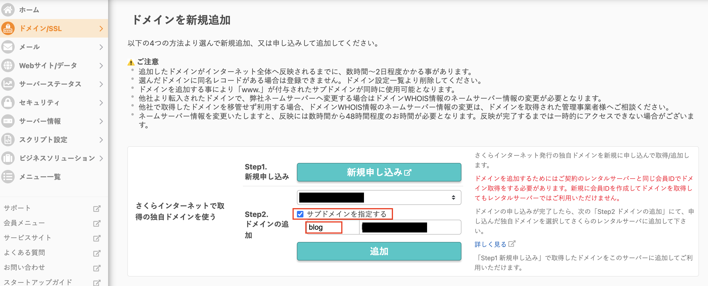

# サブドメインにWordPressを移行する

## 前書き

ブログサイトのWordPressをテストサイト(Xserver)から本番サイト(Sakura)のサブドメインとして移行した手順です。

**テストサイト**  
https://le-collection-blog.envi-de-mode-81.work  
Basic: le-collection / ptest  
↓  
**本番サイト(https://www.le-collection.com)のサブドメイン**  
https://blog.le-collection.com


## 手順

1. ブログサイトのバックアップ
    - WordPressファイル
    - データベース
1. サブドメインの追加
1. サブドメインのAレコードの追加
1. サブドメインのSSLの設置
1. サブドメインのBasic認証をかける
1. サブドメインのphpバージョンを指定する
1. ブログのWPファイルをアップロード
1. ブログのデータベースをアップロード
1. 「Better Search Replace」というWPのプラグインで旧URLを一括で更新する


## ブログサイトのバックアップ

- **WordPressファイル**  
FTPからバックアップを取ります
- **データベース**  
phpMyAdminからsqlファイルをエクスポートします


## サブドメインの追加

blog.le-collection.com を新規追加します。

左メニューにある ドメイン/SSL > ドメイン/SSL を選択します。  
「ドメインを新規追加」ボタンを押します。
  

「さくらインターネットで取得の独自ドメインを使う」項目にある「サブドメインを指定する」チェックを入れます。サブドメイン名を入力したら「追加」ボタンを押します。



## サブドメインの A レコードの追加

今回はドメインもさくらから取っているため、[さくらインターネットのドメイン画面](https://secure.sakura.ad.jp/domain/domains)にログインします。

該当するドメイン(le-collection.com)の「ゾーン」を選択します。  
ゾーン情報画面にある編集を押して、サブドメインのAレコードを追加します：  
エントリ名：blog.le-collection.com  
タイプ：IPアドレス(A)  
データ：(IPアドレス)  
DNSチェック：チェックしなくてもいい


## サブドメインのSSLの設置

無料SSL（Let’s Encrypt）を設定します。  

手順は下記サイトを参考にしてください。  
[作成したサブドメインに無料の独自SSL設定をする](https://tomato-code.com/3655/#:~:text=%E3%81%A6%E3%81%8F%E3%81%A0%E3%81%95%E3%81%84%E3%80%82-,%E4%BD%9C%E6%88%90%E3%81%97%E3%81%9F%E3%82%B5%E3%83%96%E3%83%89%E3%83%A1%E3%82%A4%E3%83%B3%E3%81%AB%E7%84%A1%E6%96%99%E3%81%AE%E7%8B%AC%E8%87%AASSL%E8%A8%AD%E5%AE%9A%E3%82%92%E3%81%99%E3%82%8B,-%E7%8B%AC%E8%87%AA%E3%83%89%E3%83%A1%E3%82%A4%E3%83%B3%E3%81%AB)
1. 左メニューにある ドメイン/SSL > ドメイン/SSL を選択します。 
1. 設定しているドメイン一覧からSSL設定するサブドメインの「SSL」を選択してください。
1. 「登録設定を始める SSL証明書の種類を選択」をクリックしてください。
1. 「Let’s Encryptの利用ポリシーに同意する」にチェックを入れ、「Let’s Encrypt (無料SSL)」の「利用する」をクリックします。
1. これでサブドメインへの無料独自SSLの設定は完了です。


**無料SSLについて詳しく知りたい場合、公式サイトからご確認ください：**  
[無料SSLサーバー証明書 Let's Encrypt](https://rs.sakura.ad.jp/function/freessl.html)  
[無料SSL（Let’s Encrypt）を設定したい](https://help.sakura.ad.jp/rs/2153/)  
[無料SSL（Let’s Encrypt）のよくある質問](https://help.sakura.ad.jp/rs/2154/)  


## サブドメインのBasic認証をかける

移行作業中はBasic認証をかけておいて確認が取れた後に解除します。

※下記の手順は参考サイトから抜粋したもので、詳しい操作画面の画像はサイトからご確認ください。  
[さくらインターネットでコントロールパネルからベーシック認証を設定する](https://cly7796.net/blog/other/set-up-basic-authentication-on-sakura-internet/)  

1. 左メニューにある Webサイト/データ > ファイルマネージャー を選択します。
1. 左のツリーからベーシック認証を設定したいフォルダを選択します。
1. 上部メニューの 表示アドレスへの操作 > アクセス設定 を選択します。
1. 「パスワード制限」タブで「パスワード制限を使用する」にチェックを入れ、パスワードファイルの編集をクリックします。
1. ユーザの追加をクリックします。
1. ベーシック認証で使用するユーザー名とパスワードを入力して、OKをクリックします。

これで一通りの設定ができたので、OKをクリックして設定完了します。  
指定したディレクトリにアクセスして、ベーシック認証がかかっていることを確認できればOKです。

.htaccessは以下のような内容で生成されていました。
```
DirectoryIndex index.html index.htm index.shtml index.php index.cgi
Options -Indexes
AuthUserFile /home/【アカウント名】/www/【選択したフォルダ】/.htpasswd
AuthType Basic
AuthName "Web access"
Require valid-user
Satisfy all
Order deny,allow
```


## サブドメインのphpバージョンを指定する

ブログサイトと本番サイトとはWordPressのバージョンが違うため、別バージョンのphpを利用する必要があります。

さくらサーバーは管理画面からはドメイン毎のPHPバージョン切り替え設定ができませんが、`.htaccess`と`php.cgi`をサーバーにあげることで切り替えられます。  
今回はサブドメインごとにphpバージョンを切り替えるので、サブドメインのディレクトリの直下に配置します。(`/home/lecollection/www/blog.le-collection.com`)

### 手順

#### `.htaccess`と`php.cgi`を作成して、サーバーにあげる

`php.cgi`
```
#!/bin/sh
exec /usr/local/php/7.4/bin/php-cgi
```
`7.4`の部分はphpのバージョンです。利用したいphpのバージョンを自由に変更してください。


`.htaccess`
```
Action myphp-script /php.cgi
AddHandler myphp-script .php .html
```

#### `php.cgi`のパーミッションを「755」か「705」に変更します。  
&nbsp;

#### phpバーションの確認
シンプルにサブドメインに`index.php`を作成して、下記のコードを記述したら、確認できます。
```php
<?php phpinfo();?>
```

### 注意点

- `php.cgi`は必ず文字コードを「UTF-8」で、改行コードを「LF」で作成してください
- cgiファイル名は何でもいいので`php.cgi`としました。

### 参考URL
[【さくらインターネット】PHPのバージョンをディレクトリごとに変更する](https://panarea.co.jp/development/sakurainternet-phpversion)  
[【さくらのレンタルサーバ】PHPバージョンを切り替える方法](https://webst8.com/blog/sakura-php-version-setting/)


## WPファイルをアップロード

テストサイトからコピーしたWPファイルをFTPでサブドメインのディレクトリにアップします。

## データベースをアップロード

1. データベースの作成  
左メニューにある Webサイト/データ > データベース を選択します。 
「新規追加」を押して、データベース新規作成します。
  


2. sqlファイルのインポート  
phpMyAdminにログインしてして新規作成したデータベースにテストサイトからエクスポートしたsqlファイルをインポートします。


## WPのプラグイン「Better Search Replace」で旧URLを一括で更新する

旧URLがデータベースに残るので、新しいURLを一括で更新します。

「検索」フィールド：`le-collection-blog.envi-de-mode-81.work`  
「次と置換」フィールド：`blog.le-collection.com`

※「ドライランとして実行する」のチェックを入れたら、変更が加えられないため、事前に結果を確認できます。


## 完了

確認が取れたら、Basic認証を解除します。